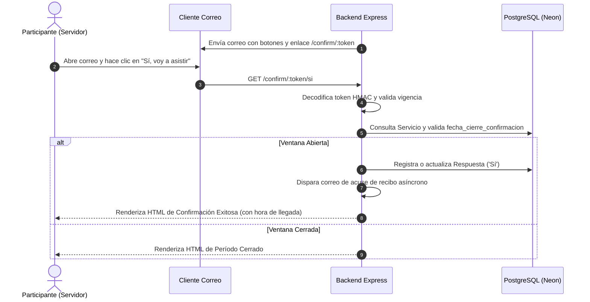

# Diseño Técnico y Arquitectura de Software

## Nombre del Proyecto
**Confirmación de Asistencia a Servicios (PAS Attendance)**

---

## 1. Arquitectura General del Sistema

```
[ Navegador Web / Cliente ]
      │
      ├── (React 19 + Vite + CSS Modules) ──> [ React Router / Dashboard UI ]
      │                                                │
      │                                       (REST API + Cookie Session)
      │                                                ▼
      └── (Correo / Link de Confirmación) ──> [ Express REST API (Node.js + TypeScript) ]
                                                       │
                                        ┌──────────────┴──────────────┐
                                        ▼                             ▼
                              [ PostgreSQL (Neon) ]        [ Mailer: Gmail / Mock ]
```

### 1.1 Topología de Despliegue (Vercel, un solo dominio)

Frontend y backend se despliegan bajo el **mismo dominio de Vercel** (un solo proyecto), no en
dos dominios separados. Esto evita CORS entre dominios distintos y evita debilitar la cookie de
sesión a `sameSite: 'none'` — el navegador trata todo como *same-origin*, igual que en desarrollo
local (donde el proxy de Vite ya cumple el mismo papel).

```
[ Navegador ]
      │  mismo dominio, ej. https://pas-attendance.vercel.app
      ▼
[ Vercel Edge / Enrutamiento ]
      ├── /api/*, /confirm/*  ──> [ Función serverless Node.js (backend/api/index.ts) ]
      │                                    │
      │                                    ▼
      │                          [ PostgreSQL (Neon) ] ◄── sesión (connect-pg-simple, DM-7)
      │
      └── todo lo demás        ──> [ Build estático (frontend/dist), React Router ]
```

`frontend/` y `backend/` se construyen como dos proyectos independientes dentro del mismo
despliegue de Vercel (ver DM-6) — no se convierte el repositorio en un *monorepo* de npm
workspaces; cada uno conserva su propio `package.json` y `node_modules`, igual que hoy.

---

## 2. Esquema Relacional de Base de Datos (DDL)

```sql
CREATE TABLE IF NOT EXISTS Grupo (
    id SERIAL PRIMARY KEY,
    nombre TEXT UNIQUE NOT NULL
);

CREATE TABLE IF NOT EXISTS Participante (
    id SERIAL PRIMARY KEY,
    nombre TEXT NOT NULL,
    primer_apellido TEXT NOT NULL,
    segundo_apellido TEXT,
    correo TEXT UNIQUE NOT NULL,
    grupo_id INTEGER NOT NULL REFERENCES Grupo(id)
);

CREATE TABLE IF NOT EXISTS Servicio (
    id SERIAL PRIMARY KEY,
    fecha_servicio DATE NOT NULL,
    hora_servicio TIME NOT NULL DEFAULT '00:00:00',
    fecha_cierre_confirmacion DATE NOT NULL,
    tipo TEXT NOT NULL DEFAULT 'Regular' CHECK (tipo IN ('Regular', 'Extraordinario')),
    fecha_creacion TIMESTAMP DEFAULT CURRENT_TIMESTAMP
);

CREATE TABLE IF NOT EXISTS Respuesta (
    id SERIAL PRIMARY KEY,
    participante_id INTEGER NOT NULL REFERENCES Participante(id),
    servicio_id INTEGER NOT NULL REFERENCES Servicio(id),
    respuesta TEXT NOT NULL CHECK (respuesta IN ('Sí', 'No')),
    timestamp TIMESTAMP DEFAULT CURRENT_TIMESTAMP,
    notificaciones_enviadas INTEGER NOT NULL DEFAULT 0,
    UNIQUE (participante_id, servicio_id)
);

CREATE TABLE IF NOT EXISTS Intento_Envio (
    id SERIAL PRIMARY KEY,
    participante_id INTEGER NOT NULL REFERENCES Participante(id),
    servicio_id INTEGER NOT NULL REFERENCES Servicio(id),
    numero_recordatorio INTEGER NOT NULL,
    timestamp TIMESTAMP DEFAULT CURRENT_TIMESTAMP,
    resultado TEXT NOT NULL CHECK (resultado IN ('exitoso', 'fallido'))
);

CREATE TABLE IF NOT EXISTS Recordatorios_Lock (
    id INTEGER PRIMARY KEY,
    bloqueado_desde TIMESTAMP
);

CREATE INDEX IF NOT EXISTS idx_respuesta_participante_servicio ON Respuesta(participante_id, servicio_id);
CREATE INDEX IF NOT EXISTS idx_intentos_servicio ON Intento_Envio(servicio_id);
CREATE INDEX IF NOT EXISTS idx_intentos_participante_servicio ON Intento_Envio(participante_id, servicio_id, resultado);
CREATE UNIQUE INDEX IF NOT EXISTS idx_intento_envio_unico ON Intento_Envio(participante_id, servicio_id, numero_recordatorio);
```

---

## 3. Decisiones Mayores de Arquitectura (DM)

### DM-1: Persistencia con `pg.Pool` Nativo y Consultas SQL Parametrizadas Directas
- **Razón:** Elimina la sobrecarga de un ORM pesado (como Prisma o TypeORM), previene dependencias de generación de código complejas y garantiza latencias ultra-bajas con Neon PostgreSQL.
- **Seguridad:** Todas las consultas utilizan sentencias parametrizadas (`$1, $2...`), haciendo imposible la inyección SQL.

### DM-2: Autenticación por Cookie de Sesión HTTP-Only
- **Razón:** Compatible 100% con `credentials: "include"` que ya utiliza el cliente `apiClient.js` en React, protegiendo las credenciales contra ataques XSS al no almacenar tokens en `localStorage`.

### DM-3: Tokens de Confirmación HMAC/JWT con Vigencia de 7 Días
- **Razón:** Los enlaces de confirmación enviados a los correos viajan firmados criptográficamente conteniendo `{ p: participanteId, s: servicioId }` con expiración automática de 7 días (`TOKEN_MAX_AGE_SEGUNDOS = 604800`).

### DM-4: Lock de una Fila (`Recordatorios_Lock`) en vez de Advisory Lock de Postgres
- **Razón:** `GET`/`POST /api/enviar-recordatorios` debe serializarse para que dos invocaciones concurrentes (doble disparo de cron, cron y panel a la vez, reintento de red) no envíen recordatorios duplicados ni excedan el tope de 3 envíos exitosos de RN-6.
- **Por qué no `pg_advisory_lock`:** el connection string de Neon usado por la aplicación es el endpoint *pooled* (PgBouncer en modo transacción), que no garantiza que un advisory lock de sesión persista entre sentencias del mismo cliente lógico. Un `UPDATE` atómico de una sola fila (`Recordatorios_Lock`) no depende de la identidad de la conexión y funciona igual bajo cualquier modo de pooling.
- **Auto-recuperación:** un lock más viejo que 10 minutos se considera abandonado (proceso caído antes de liberarlo) y puede volver a adquirirse.
- Como defensa adicional, `Intento_Envio` tiene un índice único sobre `(participante_id, servicio_id, numero_recordatorio)` con `ON CONFLICT DO NOTHING` en el `INSERT`, para que una eventual carrera no duplique la fila de auditoría.

### DM-5: `APP_BASE_URL` para los Enlaces de Correo
- **Razón:** el cuerpo HTML de los recordatorios (`recordatoriosService.ts`) necesita construir URLs absolutas hacia `/confirm/:token` y sus acciones rápidas (`/si`, `/no`). Se agregó la variable de entorno `APP_BASE_URL` (por defecto `http://localhost:5000`) en vez de hardcodear el host, siguiendo el mismo patrón de configuración por entorno que `GMAIL_USER`/`CRON_SECRET`.

### DM-6: Despliegue en un Solo Dominio de Vercel (Frontend + Backend Serverless)
- **Por qué es mayor:** cambia la arquitectura de despliegue, afecta seguridad (cookies entre dominios) y complejidad operativa.
- **Opciones consideradas:**
  - **A. Un solo dominio (elegida):** un proyecto de Vercel, `Root Directory` en la raíz del repositorio, con `vercel.json` construyendo `frontend/` (estático) y `backend/` (funciones serverless) por separado, enrutando `/api/*` y `/confirm/*` al backend y el resto al frontend. Sin CORS entre dominios, cookie de sesión sin cambios (`sameSite: 'lax'`).
  - **B. Dos dominios separados:** un proyecto de Vercel por cada parte. Requiere CORS con el dominio real del frontend y cambiar la cookie a `sameSite: 'none'` + `secure: true`, debilitando la superficie de la cookie de sesión sin necesidad real.
- **Decisión:** A. Justificación: resuelve el mismo problema sin tocar la seguridad de la cookie de sesión ya defendida en DM-2.
- **Consecuencia (revisada tras el despliegue real):** `frontend/` y `backend/` pasaron a ser *npm workspaces* de un único proyecto raíz (`package.json` con `"workspaces": ["backend", "frontend"]`), con un solo árbol de `node_modules` hospedado en la raíz. `vercel.json` usa el esquema moderno (`rewrites`, no `builds`/`routes`): `installCommand: "npm install"`, `buildCommand` compila solo el frontend con Vite, `outputDirectory: "frontend/dist"`, y `functions` declara explícitamente `api/index.ts` (TypeScript sin empaquetar; Vercel lo compila y rastrea sus dependencias él mismo). `rewrites` enruta `/api/*` y `/confirm/*` hacia esa función.
- **Historial de hallazgos del despliegue real (iterativo, cada uno descartó una hipótesis distinta antes de llegar a la causa raíz):**
  1. Con `builds`/`routes` explícitos (un build `@vercel/node` para `api/index.ts` fuera de un *workspace*): el rastreador de dependencias no incluye `backend/node_modules` por vivir en un paquete npm separado (`Cannot find package 'express'`).
  2. `"builds"` en `vercel.json` hace que Vercel ignore por completo `installCommand`/`buildCommand` personalizados (confirmado por la advertencia propia de build de Vercel) — ningún paso de empaquetado previo podía ejecutarse ahí de forma confiable.
  3. Al migrar a `rewrites` (confirmando en la práctica que sí preserva la ruta original `req.url` — la suposición inicial que motivó elegir `routes` era incorrecta) y empaquetar el backend con `esbuild` en un único archivo autocontenido generado por `buildCommand`: la detección automática de funciones de Vercel escanea el repositorio tal como está en git, no lo que un `buildCommand` genera en tiempo de build, así que el archivo generado nunca se registraba como función.
  4. Versionando ese bundle (`api/index.cjs`) directamente en git: la extensión `.cjs` no es reconocida por la detección automática de funciones de Vercel.
  5. Declarando la función explícitamente vía la propiedad `functions` de `vercel.json`: un objeto de configuración vacío (`{}`) es inválido: "Function must contain at least one property".
  6. Con `functions` válido apuntando al bundle único: el propio compilador de Vercel, al intentar rastrear ese archivo ya empaquetado, entra en un bucle patológico de escaneo de archivos y agota la memoria (reproducido de forma consistente en build local con `vercel build`).
  7. Volviendo a `api/index.ts` sin empaquetar + `includeFiles: "backend/node_modules/**"`: el build sí completa, pero archivos de datos no-JS requeridos en tiempo de ejecución por dependencias transitivas (p. ej. `codes.json` de `statuses`, usado por Express) quedan fuera del paquete final, incluso con una ruta exacta en `includeFiles`.

  Cada uno de estos hallazgos comparte la misma causa raíz: el backend vivía en un paquete npm separado, fuera del árbol de dependencias que las herramientas de Vercel esperan poder rastrear de forma confiable. La corrección definitiva (adoptar *workspaces*, revirtiendo la decisión original de mantener los paquetes separados) elimina el problema de raíz en vez de parchear sus síntomas uno por uno: verificado con `vercel build` local, que reproduce fielmente el pipeline de Vercel sin necesidad de desplegar.

  **Cuarto hallazgo:** aun con `api/index.cjs` versionado, la detección automática de funciones no lo registraba (confirmado descartando caché de build por completo). Corrección final: declarar la función explícitamente con la propiedad `functions` de `vercel.json` (`"functions": { "api/index.cjs": {} }`), sin depender de ninguna heurística de autodetección.

### DM-7: Sesión del Coordinador Persistida en Postgres, no en Memoria
- **Por qué es mayor:** afecta seguridad y disponibilidad. En un entorno serverless, cada invocación es una instancia aislada y efímera; la memoria del proceso (donde vive la sesión hoy) no sobrevive entre invocaciones ni se comparte entre instancias concurrentes.
- **Opciones consideradas:**
  - **A. `connect-pg-simple` sobre la misma base Neon (elegida):** cambia *dónde* vive el dato de sesión (una tabla `session` en Postgres, creada por la misma librería), sin tocar el mecanismo de autenticación (`express-session`, cookie HTTP-only) ni ningún controlador.
  - **B. Autenticación sin estado (JWT) para el coordinador:** eliminaría el problema de raíz, pero reemplaza por completo el mecanismo de login ya implementado y defendido (DM-2), para un beneficio que este proyecto no necesita (un único coordinador, sin requisitos de escalado horizontal de sesiones).
- **Decisión:** A. Es el cambio mínimo que resuelve el problema real sin reabrir una decisión de arquitectura ya aprobada.
- **Consecuencia:** nueva dependencia (`connect-pg-simple`); la tabla `session` se crea de forma idempotente junto con el resto del esquema (`db/index.ts`), siguiendo el mismo patrón que las demás tablas del proyecto.

---

## 4. Diagrama de Secuencia: Flujo de Confirmación de Asistencia



---

## 5. Matriz de Trazabilidad de Requisitos

| Requisito | Componentes del Backend | Componentes del Frontend | Validación Automatizada |
|---|---|---|---|
| **RF-1** (Sesión/Login) | `authController.ts`, `middlewares/auth.ts` | `LoginPage.jsx`, `useSession.js`, `sessionApi.js` | `etapa1.test.ts` (Login, logout, 401) |
| **RF-2, RN-1, RN-3, RN-4** (Servicios) | `servicesController.ts`, `serviciosService.ts`, `models/servicio.model.ts` | `ServicesPage.jsx`, `CreateServicePage.jsx`, `ServiceDetailPage.jsx`, `servicesApi.js` | `etapa2.test.ts` (Validación de fechas, cálculo de estados, ordenamiento) |
| **RF-3** (Personas y Roles) | `participantsController.ts`, `models/participante.model.ts` | `PeoplePage.jsx` | `etapa3.test.ts` (Alta, unicidad de correo, actualización de rol) |
| **RF-4, RN-2, RN-9** (Tokens y Confirmación) | `confirmController.ts`, `tokens/index.ts`, `models/respuesta.model.ts` | Vistas HTML públicas de confirmación | `etapa4.test.ts` (Validación de token, endpoints `si`/`no`, ventana cerrada) |
| **RF-5, RN-5, RN-6, RN-7, RN-8** (Recordatorios) | `remindersController.ts`, `services/recordatoriosService.ts`, `mailer/index.ts` | `ServiceSubmissionsPage.jsx` | `etapa5.test.ts` (Exclusión de roles, tope 3 envíos, generación ICS) |
| **RNF-1 a RNF-5** (Fullstack & Build) | `src/app.ts`, `src/index.ts`, `package.json` | `src/App.jsx`, `vite.config.js` | Suite completa de Vitest + `npm run build` |
