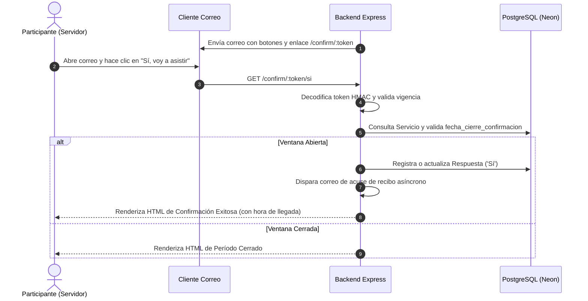

# Diseño Técnico y Arquitectura de Software

## Nombre del Proyecto
**Confirmación de Asistencia a Servicios (PAS Attendance)**

---

## 1. Arquitectura General del Sistema

```
[ Navegador Web / Cliente ]
      │
      ├── (React 19 + Vite + CSS Modules) ──> [ React Router / Dashboard UI ]
      │                                                │
      │                                       (REST API + Cookie Session)
      │                                                ▼
      └── (Correo / Link de Confirmación) ──> [ Express REST API (Node.js + TypeScript) ]
                                                       │
                                        ┌──────────────┴──────────────┐
                                        ▼                             ▼
                              [ PostgreSQL (Neon) ]        [ Mailer: Gmail / Mock ]
```

---

## 2. Esquema Relacional de Base de Datos (DDL)

```sql
CREATE TABLE IF NOT EXISTS Grupo (
    id SERIAL PRIMARY KEY,
    nombre TEXT UNIQUE NOT NULL
);

CREATE TABLE IF NOT EXISTS Participante (
    id SERIAL PRIMARY KEY,
    nombre TEXT NOT NULL,
    primer_apellido TEXT NOT NULL,
    segundo_apellido TEXT,
    correo TEXT UNIQUE NOT NULL,
    grupo_id INTEGER NOT NULL REFERENCES Grupo(id)
);

CREATE TABLE IF NOT EXISTS Servicio (
    id SERIAL PRIMARY KEY,
    fecha_servicio DATE NOT NULL,
    hora_servicio TIME NOT NULL DEFAULT '00:00:00',
    fecha_cierre_confirmacion DATE NOT NULL,
    tipo TEXT NOT NULL DEFAULT 'Regular' CHECK (tipo IN ('Regular', 'Extraordinario')),
    fecha_creacion TIMESTAMP DEFAULT CURRENT_TIMESTAMP
);

CREATE TABLE IF NOT EXISTS Respuesta (
    id SERIAL PRIMARY KEY,
    participante_id INTEGER NOT NULL REFERENCES Participante(id),
    servicio_id INTEGER NOT NULL REFERENCES Servicio(id),
    respuesta TEXT NOT NULL CHECK (respuesta IN ('Sí', 'No')),
    timestamp TIMESTAMP DEFAULT CURRENT_TIMESTAMP,
    notificaciones_enviadas INTEGER NOT NULL DEFAULT 0,
    UNIQUE (participante_id, servicio_id)
);

CREATE TABLE IF NOT EXISTS Intento_Envio (
    id SERIAL PRIMARY KEY,
    participante_id INTEGER NOT NULL REFERENCES Participante(id),
    servicio_id INTEGER NOT NULL REFERENCES Servicio(id),
    numero_recordatorio INTEGER NOT NULL,
    timestamp TIMESTAMP DEFAULT CURRENT_TIMESTAMP,
    resultado TEXT NOT NULL CHECK (resultado IN ('exitoso', 'fallido'))
);

CREATE INDEX IF NOT EXISTS idx_respuesta_participante_servicio ON Respuesta(participante_id, servicio_id);
CREATE INDEX IF NOT EXISTS idx_intentos_servicio ON Intento_Envio(servicio_id);
CREATE INDEX IF NOT EXISTS idx_intentos_participante_servicio ON Intento_Envio(participante_id, servicio_id, resultado);
```

---

## 3. Decisiones Mayores de Arquitectura (DM)

### DM-1: Persistencia con `pg.Pool` Nativo y Consultas SQL Parametrizadas Directas
- **Razón:** Elimina la sobrecarga de un ORM pesado (como Prisma o TypeORM), previene dependencias de generación de código complejas y garantiza latencias ultra-bajas con Neon PostgreSQL.
- **Seguridad:** Todas las consultas utilizan sentencias parametrizadas (`$1, $2...`), haciendo imposible la inyección SQL.

### DM-2: Autenticación por Cookie de Sesión HTTP-Only
- **Razón:** Compatible 100% con `credentials: "include"` que ya utiliza el cliente `apiClient.js` en React, protegiendo las credenciales contra ataques XSS al no almacenar tokens en `localStorage`.

### DM-3: Tokens de Confirmación HMAC/JWT con Vigencia de 7 Días
- **Razón:** Los enlaces de confirmación enviados a los correos viajan firmados criptográficamente conteniendo `{ p: participanteId, s: servicioId }` con expiración automática de 7 días (`TOKEN_MAX_AGE_SEGUNDOS = 604800`).

---

## 4. Diagrama de Secuencia: Flujo de Confirmación de Asistencia



---

## 5. Matriz de Trazabilidad de Requisitos

| Requisito | Componentes del Backend | Componentes del Frontend | Validación Automatizada |
|---|---|---|---|
| **RF-1** (Sesión/Login) | `authController.ts`, `middlewares/auth.ts` | `LoginPage.jsx`, `useSession.js`, `sessionApi.js` | `etapa1.test.ts` (Login, logout, 401) |
| **RF-2, RN-1, RN-3, RN-4** (Servicios) | `servicesController.ts`, `serviciosService.ts`, `models/servicio.model.ts` | `ServicesPage.jsx`, `CreateServicePage.jsx`, `ServiceDetailPage.jsx`, `servicesApi.js` | `etapa2.test.ts` (Validación de fechas, cálculo de estados, ordenamiento) |
| **RF-3** (Personas y Roles) | `participantsController.ts`, `models/participante.model.ts` | `PeoplePage.jsx` | `etapa3.test.ts` (Alta, unicidad de correo, actualización de rol) |
| **RF-4, RN-2, RN-9** (Tokens y Confirmación) | `confirmController.ts`, `tokens/index.ts`, `models/respuesta.model.ts` | Vistas HTML públicas de confirmación | `etapa4.test.ts` (Validación de token, endpoints `si`/`no`, ventana cerrada) |
| **RF-5, RN-5, RN-6, RN-7, RN-8** (Recordatorios) | `remindersController.ts`, `services/recordatoriosService.ts`, `mailer/index.ts` | `ServiceSubmissionsPage.jsx` | `etapa5.test.ts` (Exclusión de roles, tope 3 envíos, generación ICS) |
| **RNF-1 a RNF-5** (Fullstack & Build) | `src/app.ts`, `src/index.ts`, `package.json` | `src/App.jsx`, `vite.config.js` | Suite completa de Vitest + `npm run build` |
